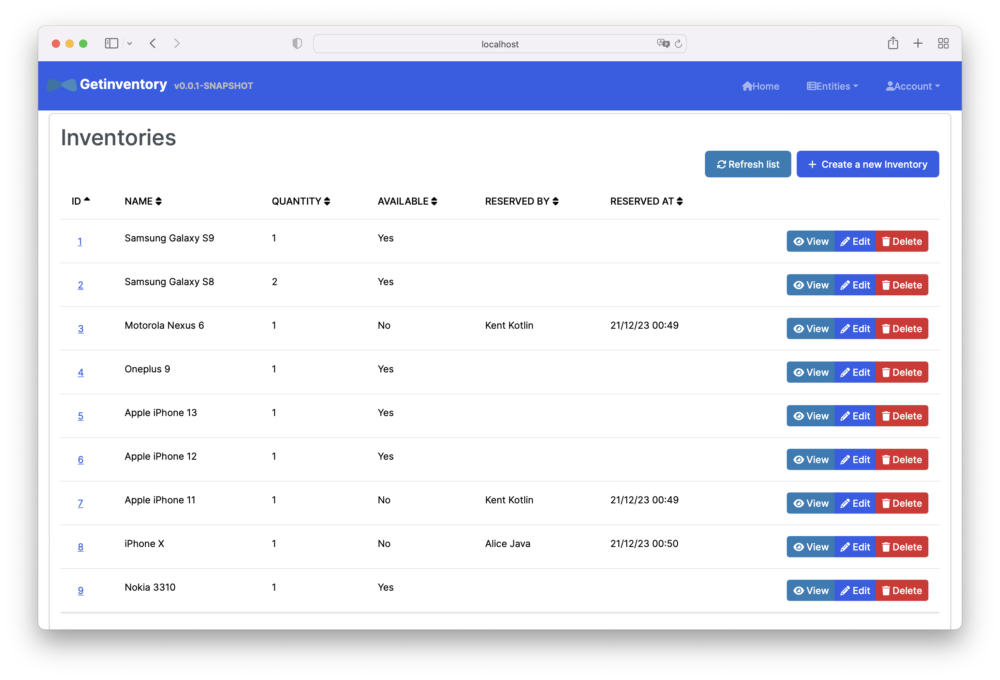

# Get Inventory

This application allows users to book an inventory and return it.
Each inventory can be in multiple quantity.
Inventory availability is checked during booking - so you can only book if quantity is available.

Here's how it looks:


## Requirements

- Users should be able to book inventories
- Sample inventory dataset (different phones) is provided
- Multiple amount quantity of inventory should be support
- Backend service should be provided
- Functionality should be tested

## Key Features and Considerations

- Project is built in Java as monolithic application for MVP to have UI and authentication in place and can be
  updated to microservice approach
- Implemented full-stack application that has UI and user authentication
- The solution is made to make it work and deliver broader solution rather than focused backend-only service
  with limited functionality. Some thing are not made ideal
- UI is not main point of implementation - but rather focused on backend service and app as whole
- Testing is done for main use-cases as integration tests and unit tests
- Full end-to-end tests are omitted and replaced with integration tests for main use cases
- It needs to use JWT tokens vs default auth
- Kafka as message broker
- I may miss something and many things can be improved and made differently

## Main Scenarios

We have an inventory set defined in `inventory.csv`:
We'll use 2 testers for main use cases: Kent and Alice.

1. Kent books two phones. Availability should be updated appropriately.
2. Alice should not be able to book phone which is not available.
3. Alice should not be able to return other’s phone.
4. Alice should be able to book second Samsung S8.
5. Kent shouldn’t be able to book third Samsung S8.

## What is interesting about this project?

Project touches following aspects:

- REST API design - how would you merge data if there would be multiple
  microservices
- Booking reservation availability synchonization is based on database transactions
- How do design domain model properly
- How user requests maps to HTTP REST API
- Transactions are made via transaction management and transaction
  will be declined if kafka doesn't acknowledge commit
- Transactions with kafka can be optimized using [Transactional outbox](https://microservices.io/patterns/data/transactional-outbox.html).

## What is cumbersome?

- To build a simple project it needs multiple things: users,
  authentication, UI that can be split into microservices if
  there is a team in place
- transactin management becomes difficult when it needs
  to talk to external system - kafka

## Diving in to project

Please checkout project structure, how to run production build
and how to run all tests in the sections below.

## Project Structure

App is based on JHipster 8.1.0 which helped to scaffold skeleton and UI, you can find documentation and
help at [https://www.jhipster.tech/documentation-archive/v8.1.0](https://www.jhipster.tech/documentation-archive/v8.1.0).

`/src/*` structure follows default Java structure.

- `/src/main/docker` - Docker configurations for the application and services that the application depends on
- `src/main/resources/config/liquibase/data/inventory.csv` - This sample phone inventory dataset that will be setup
  upon clean install.

## Development

Prerequisites:

1. [Node.js][].
2. Java 19+.
3. Docker (optional)

Run application in development:

```
./gradlew bootRun
```

Run kafka with docker:

```
docker compose -f src/main/docker/kafka up
```

Note: when creating new reservation it may require to add `127.0.0.1 kafka` to `/etc/hosts`.

## Building for production

### Run with Docker

1. Build docker image with:
   ```shell
   ./gradlew -Pprod bootJar jibDockerBuild
   ```
2. Run application, postgres and kafka using docker compose:
   ```shell
   docker-compose -f src/main/docker/app.yml up
   ```

### Run as jar

To build the final jar and optimize the getinventory application for production, run:

```
./gradlew -Pprod clean bootJar
```

This will concatenate and minify the client CSS and JavaScript files. It will also modify `index.html` so it references these new files.
To ensure everything worked, run:

```
java -jar build/libs/*.jar
```

### Opening application

Then navigate to [http://localhost:8080](http://localhost:8080) in your browser.

Use test users (checkout main page) to login.

Refer to [Using JHipster in production][] for more details.

## Testing

### Spring Boot tests

To launch your application's tests, run:

```
./gradlew test integrationTest jacocoTestReport
```

### Client tests

Unit tests are run by [Jest][]. They're located in [src/test/javascript/](src/test/javascript/) and can be run with:

```
npm test
```

## Others

### Code quality using Sonar

Sonar is used to analyse code quality. You can start a local Sonar server (accessible on http://localhost:9001) with:

```
docker compose -f src/main/docker/sonar.yml up -d
```

Note: we have turned off forced authentication redirect for UI in [src/main/docker/sonar.yml](src/main/docker/sonar.yml) for out of the box experience while trying out SonarQube, for real use cases turn it back on.

You can run a Sonar analysis with using the [sonar-scanner](https://docs.sonarqube.org/display/SCAN/Analyzing+with+SonarQube+Scanner) or by using the gradle plugin.

Then, run a Sonar analysis:

```
./gradlew -Pprod clean check jacocoTestReport sonarqube -Dsonar.login=admin -Dsonar.password=admin
```

Additionally, Instead of passing `sonar.password` and `sonar.login` as CLI arguments, these parameters can be configured from [sonar-project.properties](sonar-project.properties) as shown below:

```
sonar.login=admin
sonar.password=admin
```

For more information, refer to the [Code quality page][].

### Using Docker to simplify development (optional)

You can use Docker to improve your JHipster development experience. A number of docker-compose configuration are available in the [src/main/docker](src/main/docker) folder to launch required third party services.

For example, to start a postgresql database in a docker container, run:

```
docker compose -f src/main/docker/postgresql.yml up -d
```

To stop it and remove the container, run:

```
docker compose -f src/main/docker/postgresql.yml down
```

You can also fully dockerize your application and all the services that it depends on.
To achieve this, first build a docker image of your app by running:

```
npm run java:docker
```

Or build a arm64 docker image when using an arm64 processor os like MacOS with M1 processor family running:

```
npm run java:docker:arm64
```

Then run:

```
docker compose -f src/main/docker/app.yml up -d
```

When running Docker Desktop on MacOS Big Sur or later, consider enabling experimental `Use the new Virtualization framework` for better processing performance ([disk access performance is worse](https://github.com/docker/roadmap/issues/7)).

For more information refer to [Using Docker and Docker-Compose][], this page also contains information on the docker-compose sub-generator (`jhipster docker-compose`), which is able to generate docker configurations for one or several JHipster applications.

## Continuous Integration (optional)

To configure CI for your project, run the ci-cd sub-generator (`jhipster ci-cd`), this will let you generate configuration files for a number of Continuous Integration systems. Consult the [Setting up Continuous Integration][] page for more information.

[JHipster Homepage and latest documentation]: https://www.jhipster.tech
[JHipster 8.1.0 archive]: https://www.jhipster.tech/documentation-archive/v8.1.0
[Using JHipster in development]: https://www.jhipster.tech/documentation-archive/v8.1.0/development/
[Using Docker and Docker-Compose]: https://www.jhipster.tech/documentation-archive/v8.1.0/docker-compose
[Using JHipster in production]: https://www.jhipster.tech/documentation-archive/v8.1.0/production/
[Running tests page]: https://www.jhipster.tech/documentation-archive/v8.1.0/running-tests/
[Code quality page]: https://www.jhipster.tech/documentation-archive/v8.1.0/code-quality/
[Setting up Continuous Integration]: https://www.jhipster.tech/documentation-archive/v8.1.0/setting-up-ci/
[Node.js]: https://nodejs.org/
[NPM]: https://www.npmjs.com/
[Webpack]: https://webpack.github.io/
[BrowserSync]: https://www.browsersync.io/
[Jest]: https://facebook.github.io/jest/
[Leaflet]: https://leafletjs.com/
[DefinitelyTyped]: https://definitelytyped.org/
